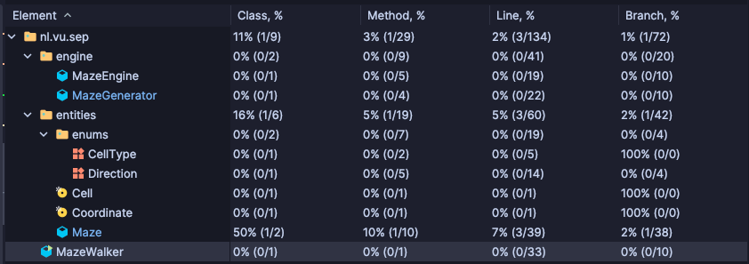
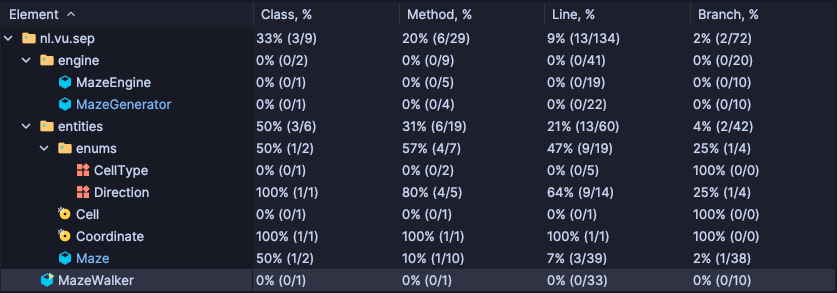
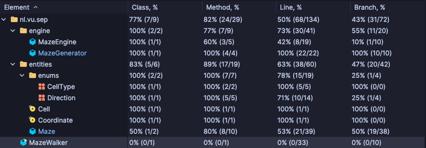
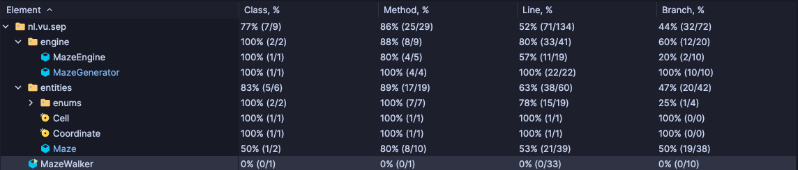
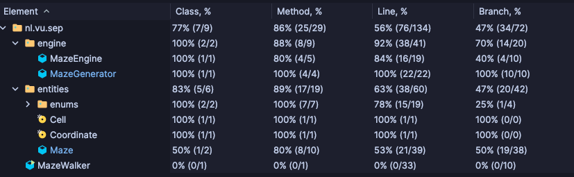
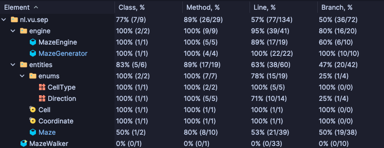

# Report for Assignment 1 - RESIT

## Project

This project is inspired in one of the initial projects from the course Computer Programming. There, you had to create a maze and
use backtracking to find a path from beginning to end. I merged this idea of maze generation with an interactive gameplay.
The result was Maze Walker. A maze is created and the player has to find the path to the end, with human input.

Disclaimer: no code from the Computer Programming assignment was used nor looked at. The only thing used was the idea.
The Computer Programming assignment was made in C++ and was done almost two years ago.

Programming language: Java

## Initial test

### Test

The first test checks whether an exception is thrown when a user tries to create a maze with size 2 (the valid sizes are between 3 and 15, inclusive)
Code:

```java
    @Test
    void constructor_WithSize2_ShouldThrowError() {
        assertThrows(IllegalArgumentException.class, () -> {
            new Maze(2);
        });
    }
```

The code can also be found on the repository ([see here](https://github.com/Castruu/assignment-1-sep-maze-walker/blob/master/src/test/java/nl/vu/sep/entities/MazeTest.java#L13-L18))

Introduced on this commit: [ee19f7b](https://github.com/Castruu/assignment-1-sep-maze-walker/commit/ee19f7bf4b8a6c93e90df238e019c178ee6a33b5)

### Coverage of initial test

To measure the coverage of all tests, the [built-in IntelliJ Coverage tool](https://www.jetbrains.com/help/idea/code-coverage.html) was used.
It is very intuitive and built-in the IDE used for coding, hence provides an amazing developer experience and easy way to measure the coverage during the test phase.



#### Coverage in numbers:
- Class coverage: **11%**
- Method coverage: **3%**
- Line coverage: **2%**
- Branch coverage **1%**

The most important aspect of this screenshot is the branch coverage. It measures the decision outcomes in the program.

This test measures a single decision path (when the user inputs an invalid size for the maze). We can see that the coverage improves from **0%** (no coverage) to **1%**. This is still far from the desirable *100%*. 

The goal of this project is to achieve full coverage on all classes besides `MazeWalker.java`, which is the entry point of the application. Since it deals with real-time user input, it is hard to test it.

Note: You can see that some classes already have 100% of branch coverage. This happens for a phenom called *vacuous truth*. Since there is no decision to be tested in those classes, it tests 100% of the decisions.


## Coverage improvement

All coverages will be incremental. Test 1 will report the coverage of the initial test + the coverage of test 1. That ensures
that the coverage is increasing with every addition.

Many tests are omitted here. Five meaningful tests will be shown here, but the full test suite of this project is much
larger and achieves the intended *100%* coverage. Feel free to explore the `test` folder to see it.

### Individual tests

#### Test 1 - `DirectionTest.getDirectionFromLetter_WithS_ShouldReturnSouth`

```java
    @Test
    void getDirectionFromLetter_WithS_ShouldReturnSouth() {
        assertEquals(Direction.SOUTH, Direction.getDirectionFromLetter('S'));
    }
```

Commit: [a5cb776](https://github.com/Castruu/assignment-1-sep-maze-walker/commit/a5cb77616eb269d7f55e8454ae0ea6182fe91896)

Coverage screenshot:



A mild improve from **1%** to **2%** can be observed. However, the branch coverage of the class `Direction` increased from
*0%* to *25%*. 

This test validates whether the method, with a valid input `'N'` returns the desired result NORTH. It checks the switch condition where the input is equal to 'N', hence exploring a decision path and improving the branch coverage.

#### Test 2 - `MazeEngineTest.constructor_WithSeed10AndSize10_ShouldHaveAPlayerOn1x1`

```java
    @Test
    void constructor_WithSeed10AndSize10_ShouldHaveAPlayerOn1x1() {
        MazeEngine engine = new MazeEngine(10, 10);
        Cell cell = engine.getMaze().getCell(new Coordinate(1, 1));

        assertEquals(CellType.PLAYER, cell.type());
    }
```

Commit: [b3ee1e1](https://github.com/Castruu/assignment-1-sep-maze-walker/commit/b3ee1e1cd4f1bac47bb49869b07e6494dca5b6f6)

Coverage screenshot:



This test provides a significant improvement from *2%* to *43%*. The `MazeEngine` constructor method is a complex method that invokes
many methods from other classes. Hence, a variety of decision nodes are made on this single execution, explaining the sudden increase in coverage.

This test validates whether the constructor without an explicit initial player coordinate sets the player correctly at coordinate 1x1

#### Test 3 - `MazeEngineTest.movePlayer_From1x1ToNorth_ShouldThrowError`

```java
    @Test
    void movePlayer_From1x1ToNorth_ShouldThrowError() {
        MazeEngine engine = new MazeEngine(10, 10, new Coordinate(1, 1));

        assertThrows(IllegalArgumentException.class,
                () -> engine.movePlayer(Direction.NORTH)
        );
    }
```

Commit: [b3ee1e1](https://github.com/Castruu/assignment-1-sep-maze-walker/commit/b3ee1e1cd4f1bac47bb49869b07e6494dca5b6f6)

Coverage screenshot:



This test makes an improvement from *43%* to *44%*. The `movePlayer` method can only move a player if the resulting position is in bounds, and it passes through an `if case` to validate that.
In case it is not in bounds, it throws an exception. If a player is on 1x1 (top-left most position) and tries to go more north, it should throw an out of bounds error.

Since it explores a single new decision path, it is expected to increase slightly the branch coverage. 

#### Test 4 - `MazeEngineTest.movePlayer_From1x1ToSouthWithPathIn1x2_ShouldSetPlayerOn1x3`

```java
    @Test
    void movePlayer_From1x1ToSouthWithPathIn1x2_ShouldSetPlayerOn1x3() {
        MazeEngine engine = new MazeEngine(10, 10, new Coordinate(1, 1));
        engine.getMaze().setCellType(new Coordinate(1, 2), CellType.PATH);

        engine.movePlayer(Direction.SOUTH);

        Cell cell = engine.getMaze().getCell(new Coordinate(1, 3));

        assertEquals(CellType.PLAYER, cell.type());
    }
```

Commit: [b3ee1e1](https://github.com/Castruu/assignment-1-sep-maze-walker/commit/b3ee1e1cd4f1bac47bb49869b07e6494dca5b6f6)

Coverage screenshot:



This test makes an improvement from *44%* to *47%*. The `movePlayer` method will move a player from the starting position to the direction passed as an argument.
In this case, it explores two decision paths: destination is in bounds and there is no wall between source and destination. That also explains the branch coverage going from *32/72* to *34/72*

#### Test 5 - `MazeEngineTest.isPlayerAtEndOfMaze_WithPlayerAt5x5OnMazeSize3_ShouldReturnTrue`

```java
    @Test
    void isPlayerAtEndOfMaze_WithPlayerAt5x5OnMazeSize3_ShouldReturnTrue() {
        MazeEngine engine = new MazeEngine(10, 3, new Coordinate(5, 5));

        assertTrue(engine.isPlayerInEndOfMaze());
    }
```

Commit: [b3ee1e1](https://github.com/Castruu/assignment-1-sep-maze-walker/commit/b3ee1e1cd4f1bac47bb49869b07e6494dca5b6f6)

Coverage screenshot:



This test makes an improvement from *47%* to *50%*. The `isPlayerInEndOfMaze` tests whether the player in is maze.getSize() - 2 x maze.getSize() - 2. The formula for calculating the total size `intiial_size * 2 + 1`, (e.g. with 3 -> becomes 7) and since the last row and column are walls, we need to subtract two.

This test checks whether a player on the final position (for a 3 sized maze is at 5x5) correctly outputs true as the result. It tests the conditional clauses on the return of the method, increasing the decision paths it executes and, consequentially, increasing branch coverage


## Conclusion

The 5 tests presented and their description show that every test added improves somehow to the reliability of the program.
In case you are interested in seeing the full test suite, explore around the `test` folder.
